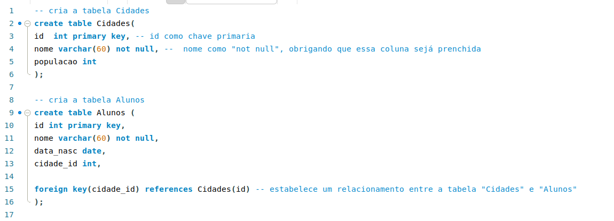
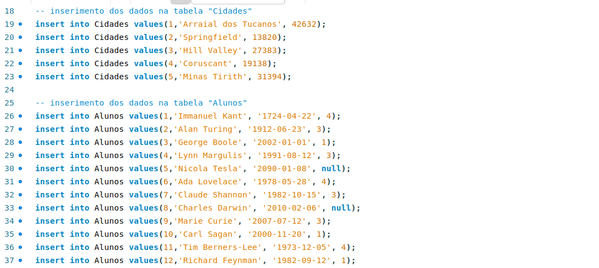
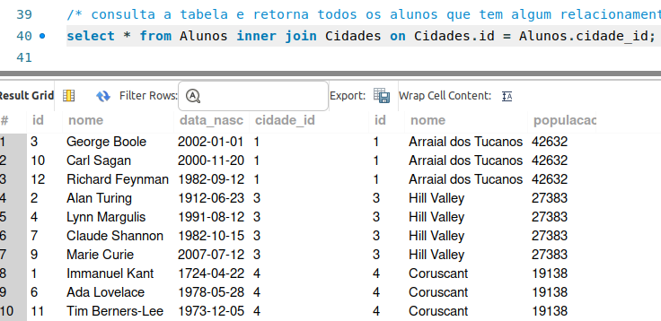

# Alunos_e_Cidades
Crie duas tabelas conforme o modelo apresentado nos slides 61 e 62, no material da AULA 7;

Preste atenção aos campos que estão no exemplo;
Insira os valores conforme os slides;

Aplique o exemplo sobre inner join dado no slide 67, do material indicado acima;

Execute essas atividades dentro o Oracle Workbench;

Crie um repositório remoto e envie o script em SQL;

Produza o Readme do repositório remoto e tire um print da tela após o término da atividade;

Coloque comentários em seu código.

### CRITÉRIOS DE AVALIAÇÃO

Está atividade corresponde as atividades complementares 2;

Utilize o tempo disponível durante a aula para execução da atividade;

Não será aceito o exercício após a data de entrega;

Execute cada uma das atividades solicitadas, a falta de algum dos itens será descontado em nota;

Caso execute em seu computador pessoal, realize a instalação dos itens a seguir para conclusão da atividade.

## Código:

